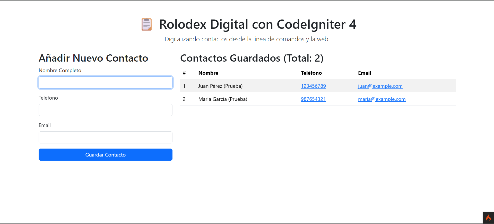

# Proyecto Rolodex con CodeIgniter 4

Este proyecto es una implementación de una agenda de contactos (Rolodex) utilizando el framework de PHP CodeIgniter 4. La aplicación permite añadir y visualizar contactos a través de una interfaz web simple y está construida siguiendo el patrón Modelo-Vista-Controlador (MVC).

## Descripción Funcional

La aplicación presenta una interfaz web con dos secciones principales:
- Un **formulario** para introducir el nombre, teléfono y email de un nuevo contacto.
- Una **tabla** que muestra todos los contactos que han sido guardados.

## Tecnologías Utilizadas

- **Framework Backend:** PHP con CodeIgniter 4.
- **Base de Datos:** SQLite 3 (configurada a través de una migración).
- **Frontend:** HTML5 y Bootstrap 5 para un diseño responsive.
- **Entorno de Desarrollo:** WSL (Ubuntu) con el servidor de desarrollo integrado de CodeIgniter (`php spark serve`).

## Cómo Ejecutar el Proyecto

1.  Clonar el repositorio.
2.  Navegar a la carpeta del proyecto.
3.  Instalar las dependencias con `composer install`.
4.  Ejecutar las migraciones de la base de datos con `php spark migrate`.
5.  Iniciar el servidor de desarrollo con `php spark serve`.
6.  Abrir el navegador en `http://localhost:8080`.

## Captura de Pantalla del Funcionamiento

A continuación se muestra la aplicación funcionando con datos de prueba:

